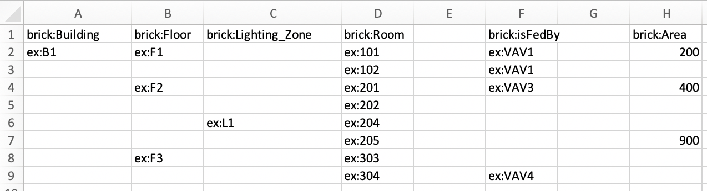

# space2brick
Convert a CSV of nested spaces to an RDF model using the Brick schema for the built environment

## Usage:
```
python space2brick.py --namespace ex http://example.com/building# simple.csv 
```

## Description:
This tool converts a simple CSV format into a [Brick Schema](https://brickschema.org) model of a building. The format is simple but somewhat limited, but can be useful for creating a model of the spaces and combined with a model generated from a different data source, e.g. a Brick model created from a BACnet scan of point names.

The tool takes a CSV and uses the header row to describe the Brick types, and then each row is converted into potentially multiple objects. An example might help.



Consider this CSV:
|brick:Building|brick:Floor|brick:Lighting_Zone|brick:Room|BLANK|brick:isFedBy|BLANK|brick:Area|
|--------------|-----------|-------------------|----------|------|-------------|------|----------|
|ex:B1         |ex:F1      |                   |ex:101    |      |ex:VAV1      |      |200       |
|              |           |                   |ex:102    |      |ex:VAV1      |      |          |
|              |ex:F2      |                   |ex:201    |      |ex:VAV3      |      |400       |
|              |           |                   |ex:202    |      |             |      |          |
|              |           |ex:L1              |ex:204    |      |             |      |          |
|              |           |                   |ex:205    |      |             |      |900       |
|              |ex:F3      |                   |ex:303    |      |             |      |          |
|              |           |                   |ex:304    |      |ex:VAV4      |      |          |

(The columns marked "BLANK" shoudl be empty but Markdown doesn't like that)

The first group of columns describe the space. A space is nested under anything to the left or above it. A new row with something to the left in that row resets the inheritence, e.g. room 303 on Floor 3 is not part of ligthing zone L1. 

The blank column marks the start of a new section. This second section describes relationships that are applied to the rightmost-element in that row, e.g. VAV1 feeds Room 101, but that does not apply to Floor 1 or Building 1. 

The next blank column is the start of a third section, which is like the second section except that rather than URIs it applies Literals to the last entity in first section, e.g. room 101 has an Area of '200'. 

In the first section, each nested element is releated to ancestor via a 'brick:hasPart' relationship.

The output of the CSV above is:
```
@prefix brick: <https://brickschema.org/schema/1.1/Brick#> .
@prefix ex: <http://example.com/building#> .

ex:B1 a brick:Building ;
    brick:hasPart ex:F1,
        ex:F2,
        ex:F3 .

ex:101 a brick:Room ;
    brick:Area "200" ;
    brick:isFedBy ex:VAV1 .

ex:102 a brick:Room ;
    brick:isFedBy ex:VAV1 .

ex:201 a brick:Room ;
    brick:Area "400" ;
    brick:isFedBy ex:VAV3 .

ex:202 a brick:Room .

ex:204 a brick:Room .

ex:205 a brick:Room ;
    brick:Area "900" .

ex:303 a brick:Room .

ex:304 a brick:Room ;
    brick:isFedBy ex:VAV4 .

ex:F1 a brick:Floor ;
    brick:hasPart ex:101,
        ex:102 .

ex:F2 a brick:Floor ;
    brick:hasPart ex:201,
        ex:202,
        ex:L1 .

ex:F3 a brick:Floor ;
    brick:hasPart ex:303,
        ex:304 .

ex:L1 a brick:Lighting_Zone ;
    brick:hasPart ex:204,
        ex:205 .
```

Note that this model is incomplete - we don't define the VAVs, for example. Those are assumed to come from somewhere else and combined into the model later.

The tool accepts a list of namespaces on the commandline, the namespace command can be repeated, e.g.
```
python space2brick.py --namespace ex http://example.com/building# --namespace ex2 http://example2.com/building2#
```
The tool automatically adds a 'brick' and an 'rdf' namespace

While this tool says that it is for spaces, it is not strictly for spaces. Anything that can nest with 'brick:hasPart' could be used.

## Requirements
This tool depends on the rdflib python library. Additionally, if the [pptree](https://github.com/clemtoy/pptree) package is installed, the tool will print out a nice tree visualization
```
                            ┌ex:101([('brick:isFedBy', 'ex:VAV1')])([('brick:Area', '200')])
              ┌ex:F1([])([])┤
              │             └ex:102([('brick:isFedBy', 'ex:VAV1')])([])
              │             ┌ex:303([])([])
              ├ex:F3([])([])┤
              │             └ex:304([('brick:isFedBy', 'ex:VAV4')])([])
 ex:B1([])([])┤
              │             ┌ex:201([('brick:isFedBy', 'ex:VAV3')])([('brick:Area', '400')])
              │             ├ex:202([])([])
              └ex:F2([])([])┤
                            │             ┌ex:204([])([])
                            └ex:L1([])([])┤
                                          └ex:205([])([('brick:Area', '900')])
```

## Limitations/bugs
- It blows up on blank lines
- Doesn't write output to a file yet
- Literals are always strings
- Probably want to be able to provide a default namespace for everything so you don't have to specify that in the body, e.g. you can just write 'room 101'
